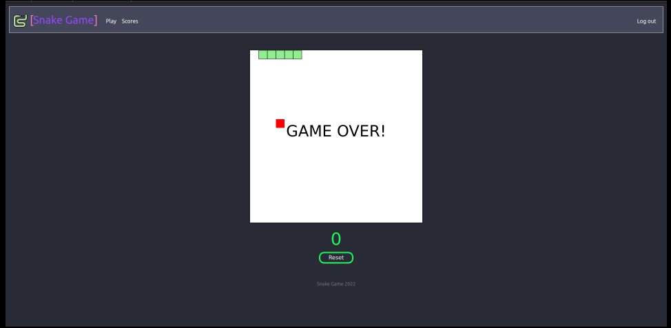
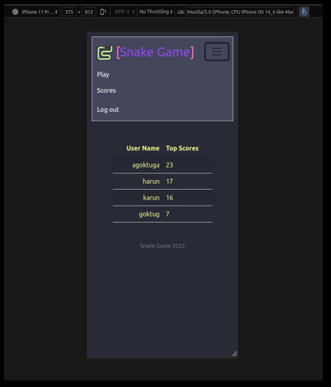

<h1>
    

        Here is a simple sneak game everyone
    

</h1>

This project my cs50 final project. I used html, css, js, python3 and sqlite for this project. This website has login and logout features to keep track of user's scores. Also website shows you top score of each user in `Scores` page.
  

